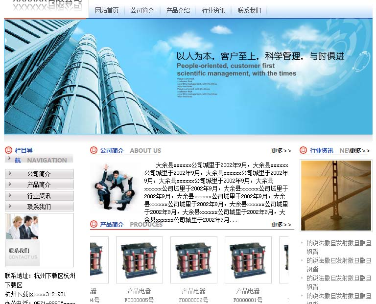

<html lang="en">
<head>
	<meta charset="UTF-8">
	<title></title>
</head>
<body>
	
我的项目或作品展示

	<dl>
		<dt>1.传统企业网站</dt>
		<dd>
			
这里是超链接：<a href="https://htmlpreview.github.io/?https://raw.githubusercontent.com/HowGraceU/traditionalHtml/master/index.html">传统企业网站</a>

			
相关介绍：传统的企业网站，所有的html共用同一个css文件，以及部分重复样式复用同一css代码。

			
		</dd>
	</dl>
	<dl>
		<dt>2.淘宝售货网页</dt>
		<dd>
			
这里是超链接：<a href="https://htmlpreview.github.io/?https://github.com/HowGraceU/taobaoShoe/blob/master/index.html">淘宝售货网页1</a>

			
相关介绍：淘宝售货网页，其中实现了对大量商品的布局，用了手风琴样式来展示不同商品（用float布局），返回顶部的按钮使用延时函数实现了滚动直顶部。

			
		</dd>
		<dd>
			
这里是超链接：<a href="https://htmlpreview.github.io/?https://github.com/HowGraceU/taobaoTunhuo/blob/master/tunhuo.html">淘宝售货网页2</a>

			
相关介绍：单纯的淘宝囤货网页。

		</dd>

		<dt>3.手机端电影推广页面</dt>
		<dd>
			
这里是超链接：<a href="https://htmlpreview.github.io/?https://raw.githubusercontent.com/HowGraceU/phoneMoive/master/phonedome.html">手机端电影推广页面</a>

			
相关介绍：手机端电影推广页面。用rem来代替px

			
		</dd>
	</dl>

	
</body>
</html>