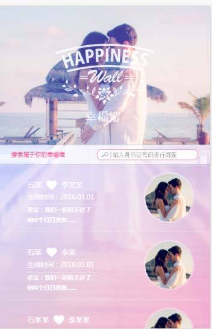
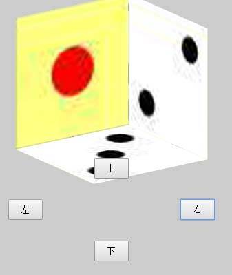

<html lang="en">
<head>
	<meta charset="UTF-8">
	<title></title>
</head>
<body>
	
我的项目或作品展示

	<dl>
		<dt>1.传统企业网站</dt>
		<dd>
			
这里是超链接：<a href="https://htmlpreview.github.io/?https://raw.githubusercontent.com/HowGraceU/traditionalHtml/master/index.html">传统企业网站</a>

			
相关介绍：传统的企业网站，所有的html共用同一个css文件，以及部分重复样式复用同一css代码。

			
		</dd>
		<dt>2.淘宝售货网页</dt>
		<dd>
			
这里是超链接：<a href="https://htmlpreview.github.io/?https://github.com/HowGraceU/taobaoShoe/blob/master/index.html">淘宝售货网页1</a>

			
相关介绍：淘宝售货网页，其中实现了对大量商品的布局，用了手风琴样式来展示不同商品（用float布局），返回顶部的按钮使用延时函数实现了滚动直顶部。

			
		</dd>
		<dd>
			
这里是超链接：<a href="https://htmlpreview.github.io/?https://github.com/HowGraceU/taobaoTunhuo/blob/master/tunhuo.html">淘宝售货网页2</a>

			
相关介绍：单纯的淘宝囤货网页。

		</dd>
		<dt>3.手机端电影推广页面</dt>
		<dd>
			
这里是超链接：<a href="https://htmlpreview.github.io/?https://raw.githubusercontent.com/HowGraceU/phoneMoive/master/phonedome.html">手机端电影推广页面</a>

			
相关介绍：手机端电影推广页面。用rem来代替px

			
		</dd>
		<dt>4.微信端幸福墙</dt>
		<dd>
			
这里是超链接：<a href="http://iadmin.ibutler.cn/iadmin/lifetime/main.do">微信端幸福墙</a>

			
相关介绍：在若恒科技做外包的时候接的任务。

			
		</dd>
		<dt>5.3d骰子</dt>
		<dd>
			
这里是超链接：<a href="https://htmlpreview.github.io/?https://github.com/HowGraceU/touzi/blob/master/touzi.html">3d骰子</a>

			
相关介绍：使用css3的3d功能制作的骰子，用定时器实现旋转。

			
		</dd>
		<dt>6.一些js练习</dt>
		<dd>
			
这里是超链接：<a href="https://github.com/HowGraceU/jsExercise">js练习</a>

		</dd>
	</dl>
</body>
</html>